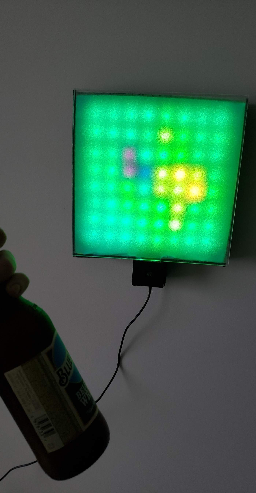

# LED Thermal Display
This project started with me impulse buying a thermal camera and later figuring out what to make with it. I ended up cutting an RGB LED strip into an 8x8 matrix and visualizing the thermal camera output!

## How it's made

Here you can see the eight separately driven LED strips, each consisting of eight diodes. These are driven by eight digital pins on the Arduino with the help of the [FastLED](https://github.com/FastLED/FastLED) library. 

The thermal sensor interfaces with the Arduino via I2C and with the help of the [Adafruit library](https://github.com/adafruit/Adafruit_AMG88xx) we can obtain an 8x8 matrix of float temperature values. In the GIF below I was still figuring out how to properly convert temperature to RGB values. 

The casing was made from black foam board and a frosted plexiglass sheet. The frosting affect was achieved using glass privacy film that was applied to both sides of the plexiglass. Overall not the cleanest way to go about things but it was fast and easy. 

Component | Link
 --- | --- 
 Arduino Nano | https://store.arduino.cc/usa/arduino-nano
 AMG8833 | https://www.adafruit.com/product/3538
 WS2812B LED Strip | https://www.amazon.com/gp/product/B01LSF4Q00/ref=ppx_yo_dt_b_search_asin_title?ie=UTF8&psc=1

Dependencies:  
[FastLED library](https://github.com/FastLED/FastLED)  
[AMG88XX library](https://github.com/adafruit/Adafruit_AMG88xx)

## More images

